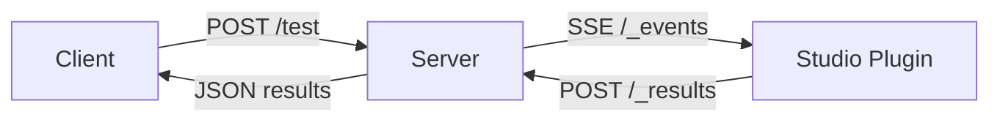

# JestLuaTestServer

A high-performance test runner for Jest Lua tests in Roblox Studio. Unlike traditional approaches like `run-in-roblox` that require Studio to open and close for each test run, JestLuaTestServer maintains a persistent Studio session that executes tests on-demand via HTTP, dramatically improving test execution speed in situations with repeated runs.

## Overview

JestLuaTestServer consists of three main components:

1. **Python Server**: A FastAPI-based server that manages Roblox Studio instances and coordinates test execution
2. **Roblox Studio Plugin**: A Lua plugin that runs inside Studio to execute Jest tests and report results
3. **Test Place**: A pre-configured Roblox place file with Jest and all dependencies installed

The system uses Server-Sent Events (SSE) for real-time communication between the server and plugin, allowing for efficient test execution without the overhead of repeatedly launching Studio or long polling.

## Features

- **Fast Test Execution**: Persistent Studio session eliminates startup/shutdown overhead
- **Simple API**: Submit tests via HTTP POST with `.rbxm` files
- **Real-time Communication**: SSE-based architecture for instant test feedback
- **Automatic Setup**: Server handles plugin installation and Studio configuration
- **Jest Integration**: Full Jest test runner with all standard features
- **Configurable Timeouts**: Customizable test execution timeouts

## Architecture



## Installation

### Prerequisites

- Python 3.11+
- Roblox Studio
- [Rojo](https://rojo.space/) (for building Roblox files)
- [Wally](https://wally.run/) (for Roblox package management)
- [UV](https://github.com/astral-sh/uv) (Python package manager)

### Setup

1. **Clone the repository**:
   ```bash
   git clone https://github.com/yourusername/JestLuaTestServer.git
   cd JestLuaTestServer
   ```

2. **Install Python dependencies**:
   ```bash
   pip install uv
   cd server
   uv pip install -e .
   ```

3. **Install Roblox tooling** (if not already installed):
   
   Install Rokit first: https://github.com/rojo-rbx/rokit?tab=readme-ov-file#installation
   ```bash
   # Install required tools
   rokit install
   ```

## Usage

### Starting the Server

```bash
cd server
uv run python run.py
```

The server will:
1. Install the Roblox Studio plugin
2. Configure required Studio FFlags
3. Build the test place with Jest dependencies
4. Launch Roblox Studio
5. Listen for /test requests

### Running Tests

Submit tests by sending a POST request to `/test` with a `.rbxm` file containing your test modules:

```python
import requests

with open("tests.rbxm", "rb") as f:
    response = requests.post(
        "http://localhost:8325/test",
        data=f.read(),
        headers={"Content-Type": "application/octet-stream"}
    )
    
print(response.json())
```

The `.rbxm` file should contain a Folder with your `.spec.lua`/`.test.lua` files and an optional `jest.config`.

```
[Folder] MyTestsModel
├── [ModuleScript] foo.spec              # Jest test modules
├── [ModuleScript] bar.spec
│   └── [Folder] SomeNestedTests         # Supports nesting
│       └── [ModuleScript] bar.spec
├── [Folder] Utils                       # You can include non-test modules to use within your tests
│       └── [ModuleScript] someUtil
└── [ModuleScript] jest.config           # Optional. Default config matches "**/*.(spec|test)" and ignores Packages & DevPackages. (https://jsdotlua.github.io/jest-lua/configuration)
```

### Test File Structure

Your test files should follow standard Jest conventions, requiring from `ReplicatedStorage.DevPackages`:

```lua
-- Sum.spec.lua
local JestGlobals = require(game:GetService("ReplicatedStorage").DevPackages.JestGlobals)

local describe = JestGlobals.describe
local it = JestGlobals.it
local expect = JestGlobals.expect

local function sum(a: number, b: number): number
	return a + b
end

describe("sum", function()
    it("should add two positives", function()
		expect(sum(1, 1)).toEqual(2)
	end)
	it("should add a positive and a negative", function()
		expect(sum(1, -1)).toEqual(0)
	end)
end)
```

## API Reference

### Endpoints

#### `POST /test`
Execute Jest tests from an uploaded `.rbxm` file.

**Request:**
- Body: Binary `.rbxm` data
- Content-Type: `application/octet-stream`

**Response:**
```json
{
  "test_id": "uuid-string",
  "status": "completed|timeout|error",
  "results": {
    // Jest test results object
  },
  "error": "error message if failed"
}
```

#### `GET /health`
Check server and Studio status.

**Response:**
```json
{
  "status": "healthy",
  "studio_running": true,
  "plugin_installed": true
}
```

#### `GET /_events` (Internal)
Server-Sent Events endpoint for plugin communication.

#### `POST /_results` (Internal)
Endpoint for plugin to submit test results.

## Configuration

### Environment Variables

All environment variables should be prefixed with `JEST_TEST_SERVER_`:

- `JEST_TEST_SERVER_HOST`: Server host (default: `127.0.0.1`)
- `JEST_TEST_SERVER_PORT`: Server port (default: `8325`)
- `JEST_TEST_SERVER_TEST_TIMEOUT`: Test execution timeout in seconds (default: `30`)
- `JEST_TEST_SERVER_LOG_LEVEL`: Logging level (default: `INFO`)
- `JEST_TEST_SERVER_CHUNK_SIZE`: SSE chunk size for rbxm transfer (default: `8192`)

### Studio FFlags

The server automatically configures these Studio FFlags:
- `DFFlagEnableHttpStreaming`: Enables HTTP streaming support
- `DFFlagDisableWebStreamClientInStudioScripts`: Allows WebStreamClient in plugins
- `DFFlagEnableWebStreamClientInStudio`: Enables WebStreamClient API
- `DFIntWebStreamClientRequestTimeoutMs`: Sets request timeout (5000ms)
- `FFlagEnableLoadModule`: Enables module loading for Jest

## Project Structure

```
JestLuaTestServer/
├── server/                 # Python server application
│   ├── app/
│   │   ├── main.py        # FastAPI application
│   │   ├── config.py      # Configuration settings
│   │   ├── endpoints/     # API endpoints
│   │   └── utils/         # Utility modules
│   ├── pyproject.toml     # Python project configuration
│   └── run.py             # Server entry point
├── plugin/                # Roblox Studio plugin
│   ├── src/
│   │   ├── Main.server.lua      # Plugin entry point
│   │   └── TestsManager.lua     # Test execution manager
│   └── default.project.json     # Rojo project configuration
├── rokit.toml            # Roblox toolchain configuration
└── selene.toml           # Lua linter configuration
```

## Known Issues

- **WebStreamClient Limitation**: Due to a current Roblox Studio bug, the plugin's `CreateWebStreamClient` is broken. As a workaround, the plugin installs itself to ServerStorage and must be manually started from the command bar instead:
  ```lua
  require(game.ServerStorage.TestsManager):start()
  ```

## License

This project is licensed under the Apache License 2.0. See the LICENSE file for details.

## Contributing

Contributions are welcome! Please feel free to submit issues and pull requests.

## Acknowledgments

- [Jest Lua](https://github.com/jsdotlua/jest-lua) for the Jest testing framework port
- [Rojo](https://rojo.space/) for Roblox project management
- [FastAPI](https://fastapi.tiangolo.com/) for the Python web framework